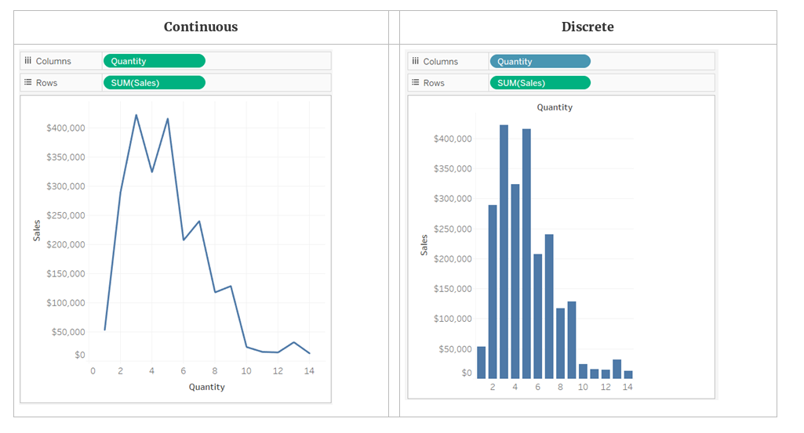

Visualizing with Tableau
========================================================
author:
date:
autosize: true

Tableau Public vs Pro
=========================================================
| Tableau Public | Tableau Desktop | 
|------:|:-----|
|   Free  | ~$700/yr or 1 yr academic |    
|  Only save to Tableau Public Server  |  Can save locally |   
|   No live data connection  |    Live data |    
|   local data, Google Sheets,  OData,  Web Data Connector  |    Local data, servers, saved data sources |    

<small>Open Data Protocol: <https://onlinehelp.tableau.com/v10.4/pro/desktop/en-us/examples_odata.html></small>    
<small>Web Data Connector: <https://onlinehelp.tableau.com/current/pro/desktop/en-us/examples_web_data_connector.htm></small>

Tableau Tutorials
========================================================
- Tableau Public Resources, Tutorials: <https://public.tableau.com/en-us/s/resources>

- Tableau Public Gallery: <https://public.tableau.com/en-us/s/gallery>

Dimensions and Measures
=========================================================

**Dimensions**:  qualitative values, names dates or geographic data. Use to categorize and segment. 
**Measures**:  numeric, quantitative valuees, can be aggrigated (the default)  

**Blue** and **Green Fields**:  
**Green** measures and dimensions are continuous.  
**Blue** measures and dimensions are discrete.

<small>From Tableau online help: <https://onlinehelp.tableau.com/current/pro/desktop/en-us/datafields_typesandroles.htm></small>  

Continuous vs Discrete
========================================================

